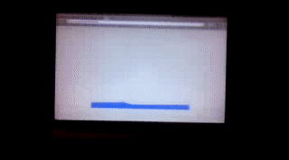

# LiquidFun
Experimenting with Google's [LiquidFun](http://google.github.io/liquidfun/), a 2D physics and fluid simulation engine.

Open the [demo page](https://kostasx.github.io/LiquidFun) in Chrome or Opera, move your laptop
to the left or to the right and see what happens.

> LiquidFun and the [DeviceOrientation API](http://www.html5rocks.com/en/tutorials/device/orientation/)

